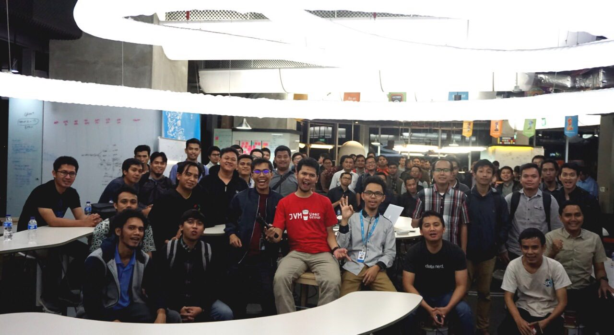
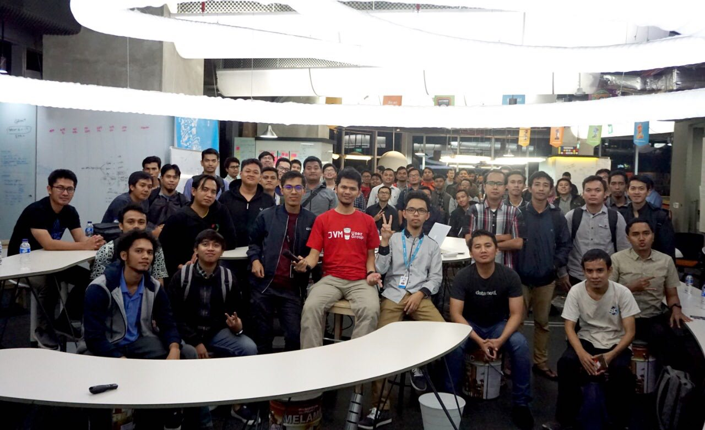
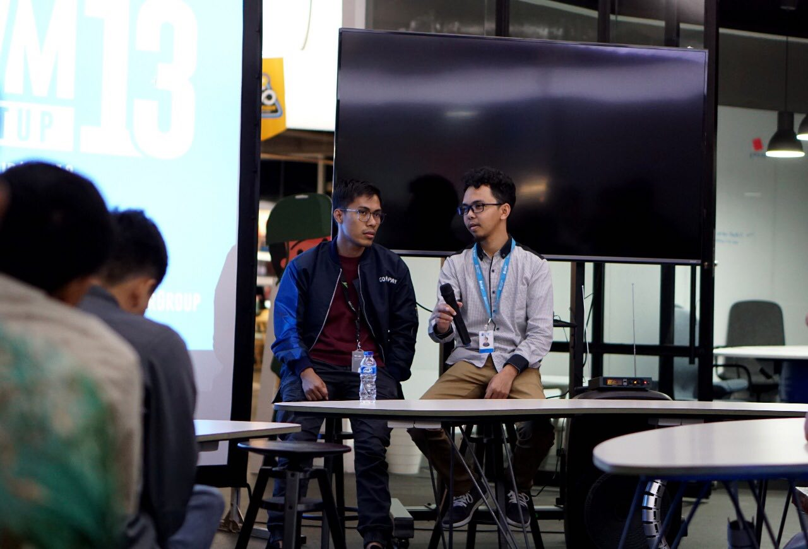
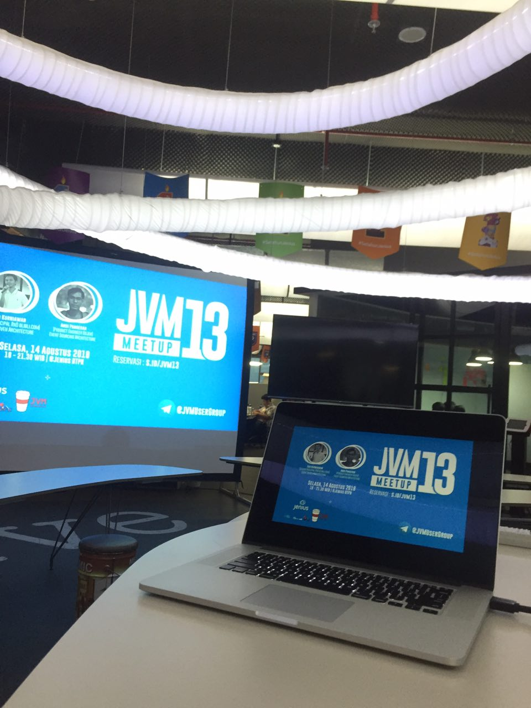
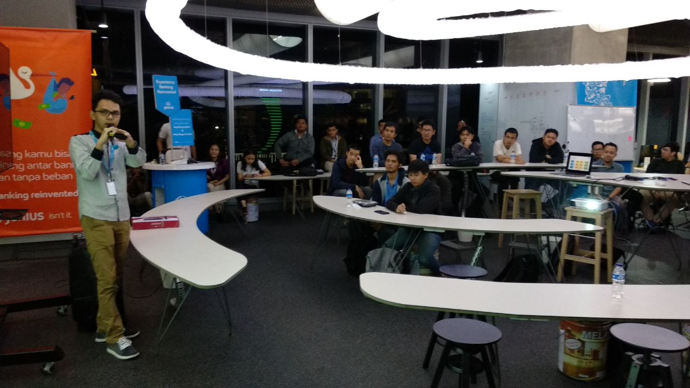
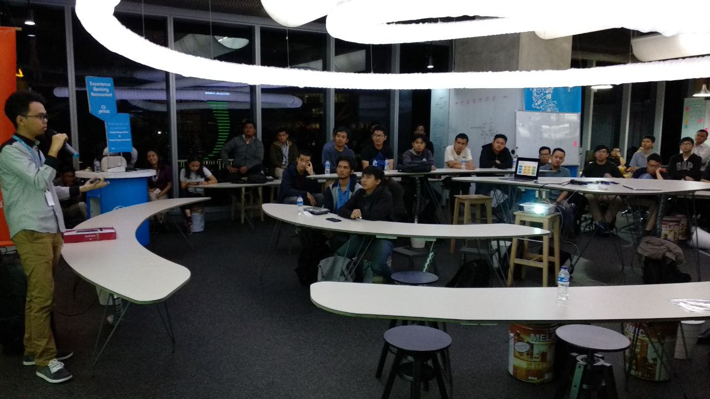
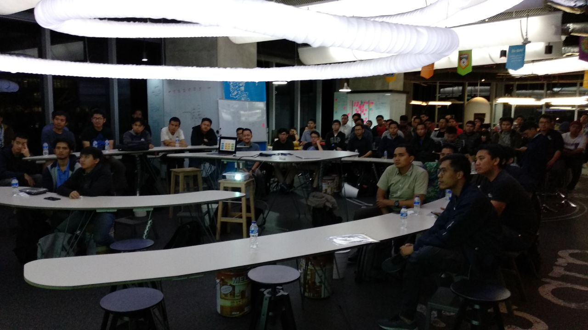
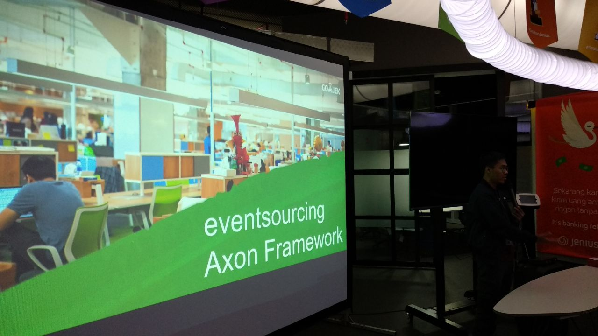
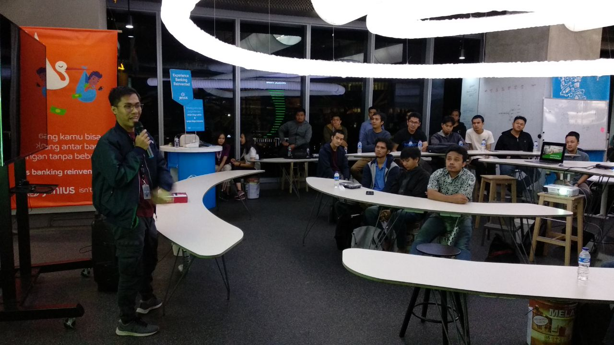
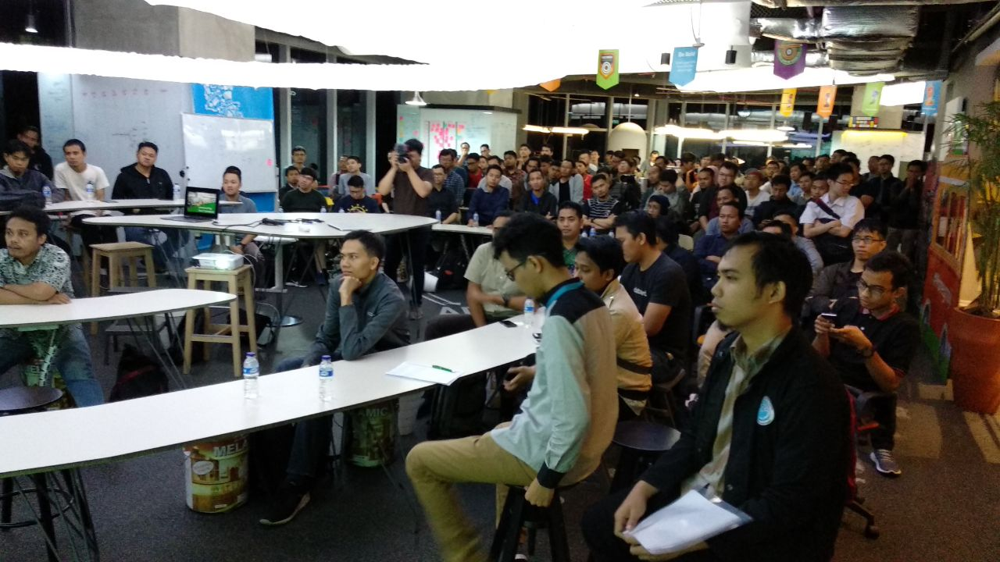

# JVM-Meetup-13
Conclusion from JVM Meetup 13 @ Jenius BTPN

Tuesday, August 14th 2018

Link Event --> [s.id/jvm13](http://s.id/jvm13)

#### Materi Slide 1 :

Eko Kurniawan Khannedy (Senior Principal RnD Blibli) --> [Event Driven Architecture](https://drive.google.com/file/d/1prbfHQPFaBUu_7NMaD8cqx-mhxhvjpKa/view?usp=sharing) 

#### Materi Slide 2 :

Andi Pangeran --> [Event Sourcing Architecture](https://drive.google.com/file/d/1B3LyT_JWoO5kBjrD02rWRqkOUFk1YxAz/view?usp=sharing) 

#### Photo Session :

#### Monggo di-Like and Subscribe.

Follow FP : [JVM Developer ID](https://www.facebook.com/JVMDeveloperID/)

Telegram : [@JVMUserGroup](https://t.me/JVMUserGroup)

Twitter : [@jvmdeveloperid](https://twitter.com/jvmdeveloperid)

Linkedin : [JVM User Group](https://www.linkedin.com/in/jvm-user-group-9ba49b142/)
